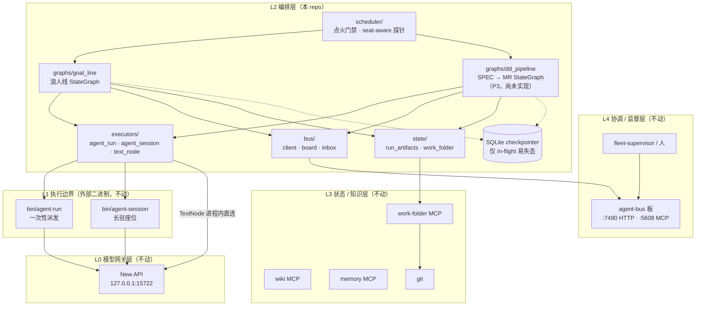
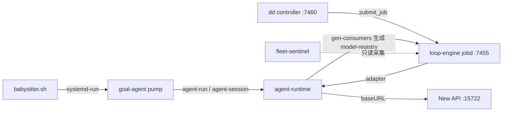
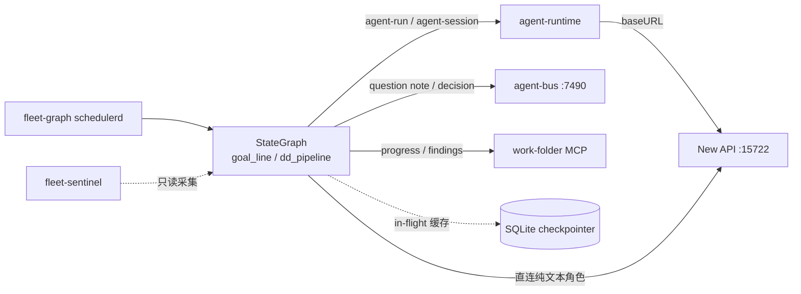

# fleet-graph 架构

> 版本 v1.0 · 2026-08-26 · 状态：P0 立项定稿
> 上游依据：work folder `wf-3f30cd` 的 `design.md` v0.2 与 `plan.md` v1.0。
> 本文件是舰队新架构的**代码库内 SSoT**；work folder 里的 design/plan 是决策过程档案，二者冲突时以本文件为准。

## 1. 这个 repo 解决什么问题

舰队（ronin 浪人线 + dev-dispatch 开发流水线）此前跑在三套彼此独立、抽象层次不一的调度实现上：

- **loop-engine**（TypeScript，25k 行）：通用节点图执行器，实际只剩 dd 的 job 提交路径一个活跃生产消费者。
- **goal-agent pump**（Python，5k 行）：浪人线的轮次泵，语义扎实但形态是自研循环。
- **babysitter**（`/data/ronin/babysitter-20260822.sh`，v27）：全舰点火命脉，却是**不在任何 git repo 里的裸脚本**。

三者叠加的代价是：控制流散落在三种语言/三种部署形态里，改一次编排逻辑要动三处；最关键的点火逻辑没有版本管理、没有测试、没有 review。

fleet-graph 把**编排**这一件事收敛成一张显式的 LangGraph 图，用一套语言、一个 repo、一种部署形态承载，并把 babysitter 的全部保护逻辑收编进 git。

明确**不解决**的问题：模型接入（New API 网关已经在位且是生产 SSoT）、agent 执行（agent-runtime CLI 已经是稳定基石）、持久状态与人机协议（katana MCP + agent-bus 是历史投入中真正值钱的部分）。这三层原样保留。

## 2. 分层



各层职责边界：

| 层 | 组件 | 归属 | 职责 |
|---|---|---|---|
| L4 | agent-bus、fleet-supervisor | 外部，不动 | 看板、人机裁决协议（`work.decision.v1`） |
| L3 | katana work-folder / wiki / memory MCP、git | 外部，不动 | durable state 的唯一家；goal/DoD/spec 保持框架无关纯文本 |
| L2 | **fleet-graph** | 本 repo | 编排：图、gate、循环、分支、点火、熔断；以及 `executors/`（对 L1 二进制的 subprocess 封装 + 进程内 TextNode）、`bus/`（agent-bus 客户端）、`state/`（磁盘契约与 work-folder 客户端） |
| L1 | agent-runtime CLI (`agent-run` / `agent-session`) | 外部，不动 | 一次 agent 执行的进程边界。**注意**：本 repo 的 `executors/` 是它的调用方，属 L2；`TextNode` 更是纯进程内实现，不经 L1 |
| L0 | New API 网关 | 外部，不动 | key 管理、channel 阶梯 failover、亲和、计量 |

### 2.1 本 repo 的包结构

| 包 | 职责 | 关键类型 |
|---|---|---|
| `graphs/` | StateGraph 与其接线；**唯一允许 import langgraph 的地方**（不变量一）。浪人线在 `goal_line` / `runner`，dev-dispatch 在 `dd_*` 五件（§2.2） | `build_goal_line_graph` / `LineDeps` / `build_dd_pipeline_graph` / `PipelineDeps` |
| `executors/` | 一次 agent 执行的封装。`agent_run` / `agent_session` 是对 L1 二进制的 subprocess 封装；`text_node` 是进程内直连网关，不经 L1 | `AgentRunLauncher` / `AgentSessionSeat` / `TextNode` |
| `bus/` | agent-bus 客户端与工作看板。**没有发布 `work.decision.v1` 的方法**——裁决只归人（§6.2） | `BusClient` / `Board` / `GateTicket` / `Inbox` |
| `state/` | durable state（不变量四）。`run_artifacts` 是 fleet-sentinel 直接消费的磁盘契约；`work_folder` 是 katana work-folder MCP 客户端 | `RunArtifacts` / `WorkFolder` |
| `scheduler/` | 点火门禁、网关探针与常驻调度。探针是 **seat → 面 + 凭证 lane** 的映射，不是单一健康检查（§6.3）；`daemon` 是按 tick 起线的常驻体，只读 terminal.json 的 `terminal` 字段 | `decide` / `GatewayProber` / `ProbeSpec` / `Scheduler` / `LineSpec` |
| `dd/` | dev-dispatch 的**契约面**：生命周期、派发、prompt、attempt context、能力锁。契约是 plugin 的，本包只读不改写（§2.2） | `Lifecycle` / `StageDispatchBuilder` / `PluginPromptSource` / `build_attempt_context` / `CapabilityLock` |

### 2.2 dev-dispatch pipeline 的形状

dd 的阶段机**不在 Python 里**。它在 plugin 的 `development-lifecycle.json` 里，`dd/lifecycle.py` 只是把它读出来。这条约束决定了这几个包的分工：

| 文件 | 职责 |
|---|---|
| `dd/lifecycle.py` | 读契约。阶段、`required_artifacts` / `produced_artifacts`、verdict 边、wrapper steps 全部来自契约文件 |
| `graphs/dd_pipeline.py` | 走图。一个 stage 走 `input_verify → actor → materialize → output_verify` 四步，判定、重试、rework、终态都在这里 |
| `graphs/dd_actors.py` | llm 阶段派谁去做：角色、模型、以及那 6 个字段的 attempt context |
| `graphs/dd_materializer.py` | 封存。调 plugin 自己的 sealer，收据摘要一律取**落盘文件的字节** |
| `graphs/dd_scripts.py` | 非 llm 阶段：configure / acceptance / merge，以及给未被 plugin 封存的阶段兜底的 `WorkspaceSealer` |
| `graphs/dd_runner.py` | 组装。把上面几件接成一条可跑的 development，并提供挂起后的 `resume` |
| `dd/bootstrap.py` | 起跑线：把 attempt context 四个文件按 canonical bytes 写好并提交 |

两条在实现里踩出来的规矩，写在这里免得再犯：

- **脊柱是推导出来的，不是抄来的**。`transitions` 表只登记 verdict 会改道的边；`configure → implement` 这类无条件边由「谁产出、谁消费同一个 artifact」推导。推导不出唯一解就抛 `AmbiguousSpine`，不猜。
- **三套词表不是一套**。dd 的阶段 id（`continuous_review`）、agent-runtime 角色输入的 stage 枚举（`review`）、契约的 `review_phase`（`continuous`）长得像但互不相等，跨界必须翻译。

## 3. 四条反锁定不变量（宪法）

这四条来自 `design.md`，是本架构不可协商的部分。任何 PR 违反其一即应被打回。

1. **框架抽象不得外渗**。`langgraph` 的类型、装饰器、State 定义只允许出现在 `src/fleet_graph/graphs/` 与 `src/fleet_graph/executors/` 内部。goal / DoD / spec 文本与 work folder 上的任何落盘状态里不得出现框架概念——保住随时换框架的自由。
2. **执行器一律进程边界**。agent 的执行只经 `bin/agent-run` / `bin/agent-session` 的 subprocess 调用，`--runtime` 一个参数即可在 claude / codex / opencode / kimi 之间替换。**绝不在编排进程内直接 spawn 某个具体 harness**（继承自 pump 的 INV-4/B8）。
3. **模型接入单点**。所有 LLM 流量经 New API `127.0.0.1:15722`。编排代码只写逻辑模型名，key / fallback / 计量不散落到各节点。
4. **durable state 只认 work folder + git**。LangGraph checkpointer 是**可以随时删掉重建的缓存**，只存 in-flight 的易失状态（当前轮次、在跑的 run_id）。任何需要在崩溃后活下来、或需要人能读的东西，都必须经 work-folder MCP 落盘。

第 4 条有个直接推论，值得单独写出来：**checkpointer 里长不出私有状态**。如果某个字段只在 checkpointer 里存在、work folder 里查不到，那它要么该进 work folder，要么该被删掉。

## 4. 旧 → 新组件映射

| 旧组件 | 位置 | 处置 | 新归属 |
|---|---|---|---|
| loop-engine jobd (`:7455`) | `/data/code/self/loop-engine`, SEA 二进制 | **退役**（P4） | `executors/AgentRunNode` + re-adopt 原语 |
| loop-engine canary / supervisor | 同上，已 inactive | **退役**（P4） | 无（事实死亡） |
| loop-engine adapter 层 | `src/adapters/*.ts` | **退役** | agent-runtime CLI 直调 |
| dd reconciler 调度循环 | `reconciler.py`（6821 行） | **重写为 graph** | `graphs/dd_pipeline.py` |
| dd `submit_job()` 路径 | `reconciler.py:4418` | **替换** | `AgentRunNode` |
| dd git_ops / materializer | `git_ops.py`（1748 行） | **库化复用** | vendor 进本 repo（见 §7 D1） |
| dd contracts 16 schema | `loop-engine-dev-dispatch-plugin/contracts/` | **库化复用** | 语义等效，schema 不改 |
| dd MCP 13 工具面 (`:5606`) | `controller_server.py` | **薄壳重建** | 映射到新 graph API，新端口 |
| goal-agent pump | `/data/code/self/goal-agent`，`pump.py`（1639 行） | **语义保留、实现重写** | `graphs/goal_line.py` |
| pump 的 INV-3/4/8/9 | 同上 | **逐条移植** | graph 节点约束 + 契约测试 |
| heartbeat.json / rounds.jsonl / terminal.json | `/data/ronin/runs/` | **文件契约保持兼容** | fleet-sentinel 无需改动即可采集 |
| babysitter | `/data/ronin/babysitter-20260822.sh`（裸脚本） | **收编进 git** | `schedulerd` 常驻服务 |
| ronin-auto-gate | `/data/ronin/auto-gate.py` | **收编** | dd graph 的可选 gate policy |
| supervisor-guard | `/data/ronin/*.sh` | **收编** | `schedulerd` 保护逻辑 |
| agent-runtime CLI | `/data/code/self/agent-runtime` | **保留不动** | L1（仅删 loop-engine consumer 边） |
| agent-bus | `/data/code/self/agent-bus` | **保留不动** | L4，新引擎作为普通 client |
| katana 三 MCP | — | **保留不动** | L3 |
| New API 网关 | `/data/code/gateway/new-api` | **保留不动** | L0 |
| ronin-mcp (`:5609`) | `/data/code/self/ronin-mcp` | **保留门面**，仅改 dd endpoint 配置 | 待确认，见 §7 D4 |

## 5. 调用边

**旧**（环形依赖是它的病征之一——agent-runtime 反过来给 loop-engine 生成 model-registry）：



**新**（单向，无环）：



## 6. 三个关键机制

### 6.1 re-adopt（detached 语义）

loop-engine jobd 靠 `KillMode=process` 让 worker 进程在 daemon 重启后存活；agent-runtime 目前没有直接等价物，但有 `--resume run_dir`。

fleet-graph 的等价物：checkpointer 记录每个在跑执行的 `run_id` / `run_dir`；graph 进程崩溃或重启后，**轮询 run_dir 状态而不是重新派发**。契约：kill graph 进程 → 重启 → 在跑的 job 既不重复派发、结果也不丢。

这是整个重构的技术风险点。P1 的契约测试不通过，P3（dd 迁移）不得开工——兜底是把 jobd 多留一段时间，P4 顺延，不影响 P2 的浪人线上线。

### 6.2 human gate

```
LangGraph interrupt → agent-bus 发 question note → 等 work.decision.v1 → resume
```

裁决只认 `work.decision.v1` 消息，**agent 不得代拍**。旧的 auto-gate 自动放行策略作为一个可选 policy 被收编，默认关闭。

实现上有三处是刻意的，都为了同一件事——让「代拍」在结构上做不到：

- `bus/board.py` **没有**发布 `work.decision.v1` 的方法。想代拍得先改这个文件，那就是一次显式的、reviewer 看得见的改动。
- `dd run --resume` **不喂任何输入**。gate 自己回板上重读，所以恢复这条线的人无法通过「恢复」把票投了。
- 没有板子时 `human_gate` 是**没有默认实现**的：走图会指名拒绝，而不是有个占位实现悄悄放行。

挂起时 run 结果会给出 `awaiting`（在等哪张 question note），CLI 退 75；这样「待会儿再来」和「跑挂了」不会混成同一个信号。

### 6.3 网关探针必须探真实依赖面

一个「面」= **endpoint + 凭证 lane**，两者都不能错：

- 调研座探 OpenAI 面 `/v1/chat/completions`，用 openai lane 的 token
- 订阅座探 `/v1/responses`，**必须 `stream:true`**（订阅 channel 只收流式），用 responses lane 的 token

探错 endpoint 或探错凭证 lane，都会**报出漏报**——明明线依赖的那个面是坏的，探针却说健康。这比不探更糟：它把「我们不知道」变成「我们查过了，没问题」。实测过：用 openai lane 的 token 探 `/v1/responses` 返回 `503 No available channel ... under group anthropic`，而座位本身完全健康。

没有注册探针的座位**直接拒绝点火**，不借用别的座位的面。

## 7. 需人拍板的开放问题

这些走 `board:work-notes` 的 question note，不自决：

- **D1**：dd 领域代码「库化复用」若执行中发现成本高于重写，需上报改判。
- **D2**：金丝雀线选择与放量节奏最终确认。
- **D3**：loop-engine repo 与 40+ worktree、`/data/ronin` 裸脚本的归档深度（archive vs 删除）。
- **D4**：ronin-mcp 是否保留为独立门面（当前默认保留，仅改 dd endpoint 配置）。

## 8. 交付阶段

| 阶段 | 内容 | 关键 DoD |
|---|---|---|
| P0 | 立项与架构文档 | repo 建立、CI 绿、本文件合入 main |
| P1 | 核心原语库 | 单测 + hello-graph 真机经网关跑通 + **re-adopt 契约测试通过** |
| P2 | ronin 线 graph | ≥1 条真实线在新引擎跑 ≥3 轮，磁盘契约与旧泵等效 |
| P3 | dd pipeline graph | 一条真实 SPEC 从 H0 走到 durable MR 全链真机通过 |
| P4 | loop-engine 退役 | 全部 unit inactive+disabled、无消费者 |
| P5 | work folder 迁移 | 17 条线全部处置完毕并有映射表 |
| P6 | 部署上线 | 新 unit 全绿、网关可归因 |
| P7 | 舰队重启与总验收 | 金丝雀 24h → 5 条 → 全量 |

阶段串行，每阶段 DoD 全绿并落 progress 后才进下一阶段。

# References

- work folder `wf-3f30cd`：`design.md` v0.2、`plan.md` v1.0、`findings-recon.md`、`findings.md`
- 现场侦察证据锚点：`pump.py:119-141/356/1131`、`reconciler.py:1632/2228/4418`、`babysitter-20260822.sh:90/132-206`、`agent-runtime profiles/routes.yaml:19/122`
