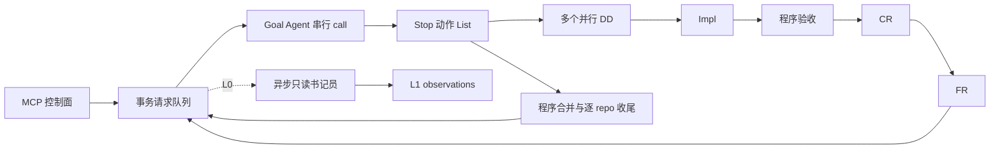

# Fleet Graph 最小系统架构

统一 MCP 负责登记、查询、消息、目标修改、停止与恢复。每 Goal 一个进程、一个 LangGraph，LangGraph 只编排一次事件循环，不保存第二套业务真相。DD 不再使用独立 scheduler、gate 服务、Goal enrollment 审批或外围监督引擎。

DD 内部线性推进，验收/CR/FR 失败返回原 Impl，保留 DD、SPEC 和 PR。FR pass 排队请求 Goal 审单。approve 引用当前 review_ref，并核对同一 HEAD 的验收、CR 和 FR。代码变动、目标版本变化或输入修订使旧批准失效，重新完整验证。needs_goal 与 interrupted 保留现场，Goal 可用 revise 恢复；cancel 是明确终结。

## 模块职责

| 模块 | 职责 |
|---|---|
| `protocol.py` | 输入与角色输出 schema，动作组合约束 |
| `store.py` | SQLite WAL 事务事件与状态折叠 |
| `engine.py` | LangGraph 的 collect/actions/schedule/observe 节点、请求与 DD 生命周期 |
| `git_ops.py` | repo/分支/SPEC/PR 核对、目标锁与 CAS push、冲突与清理 |
| `runtime.py` | agent-runtime 异步桥接、耐久启动意图、session scope 与完整 Session 查询 |
| `commands.py` | 验收子进程、进程身份、停止与完整日志 |
| `ports.py` | WF 和可选外部 reply MCP，带超时 |
| `service.py` | 控制工具、独立引擎启动、目标版本与恢复 |
| `cli.py` | 唯一服务、引擎与静态配置检查入口 |

## 请求与动作

一次请求出队只生成一次 Goal user prompt。消息、审单、steer 和运行问题分别排队，包含 caller、request_id 和隐式输出 schema。当前投影可以附在 prompt 中，但不把另一请求正文或历轮 feedback 拼接进去。Goal/Impl/CR/FR 各自按作用域续用 Session；历史通过 MCP 和 runtime 原始记录查询。

Stop 动作按列表逐项执行，末尾最多一个 waiting/blocked/done。长时间 DD 在独立进程中运行，动作执行不等待它完成。每项动作有稳定 ID、意图、结果；部分失败不会撤销此前成功项，错误成为下一条独立请求。默认 reply 写耐久 mailbox，由接收者 `goal_replies` 分页读取；可配置外部 MCP，但接收端必须兑现 idempotency_key 去重。

## 事件与恢复

每 Goal 的 SQLite 事件日志使用 WAL、FULL synchronous、事务写入。每条事件附事务结束状态，状态可从最后一个已提交事件恢复；LangGraph 内存图可重建。请求、调用、动作、验收和合并工件均有关联 ID。SQLite 事务防止半条事件成为有效状态，不依赖可损坏的 JSONL 断尾。

进程锁确保一个 Goal 引擎，Goal call 串行。运行启动先记录稳定 run_id 意图，runtime bridge 先落耐久意图再 detach。恢复先查询运行是否仍活着、结果是否已完成、Git/PR 副作用是否已发生。身份包含进程启动标识，不能仅凭 PID。未知启动不盲重派；中断保留现场并显式报告。崩溃不会自动重启，须外部 `goal_resume`。

graceful stop 不启动新步骤，等在途执行记录结果后停止。immediate stop 尝试停止本 Goal 的 runtime 与命令进程，保留代码与原始记录。stopped 的 message/steer 仅保存，resume 后执行；waiting/blocked 的新请求正常唤起。

## Git 与多 repo

所有 repo 共享 Goal source_branch，各自有 remote、target_branch 与验收命令。release 不存在时从 target 准备；已有 release 要显式 takeover 或同一操作的精确恢复 receipt。DD worktree 必须属于同一 Git common dir，分支匹配、工作树干净、HEAD 等于远端，SPEC 是已提交普通文件。

目标分支按 Git common dir 加锁，push 绑定预期远端 HEAD。非 FF 不等于冲突：无冲突时更新 source 后重验重审；有冲突时交原 Impl。整线收尾逐 repo 记录，每次核对已完成项实际远端，全部成功才 done。协议支持 release→target；本次实验只实际交付本组 release，不执行生产 main 合并。

## L0/L1

`goal_events` 可顺序读完整引擎记录；`goal_session` 经 agent-runtime 读取完整原始模型/工具/Stop 记录；`goal_artifact` 按字节分页读取本 Goal 工件，路径不得越界。L1 书记员用独立只读 harness，成功写入带 L0 引用的 observation 后才推进游标，失败不阻塞 DD。原始证据始终保留，不用摘要替代 Session。

# References
- 本组 WF `wf-53a584`：inputs/design.md、inputs/protocol.md、implementation-decisions.md。
- `src/fleet_graph/`；`tests/test_engine.py`、`tests/test_control.py`、`tests/test_git_ops.py`、`tests/test_runtime.py`。
