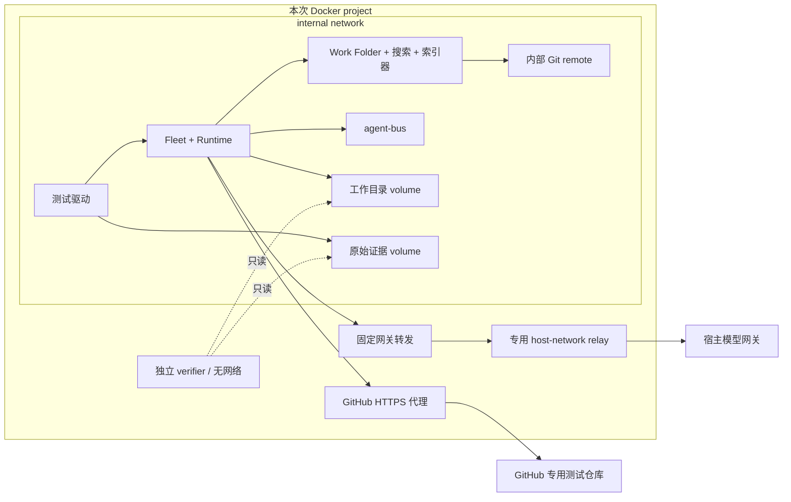

# Fleet Graph Docker E2E

本目录提供独立于产品分支的测试组件。候选由完整 Git commit SHA 指定；测试基建从 main 开发，可以对不同分支重复执行相同输入与输出契约。工作线：`wf-613744`，关联 Codex `wf-53a584`、自举组 `wf-2bf703` 与共同设计 `wf-cce72d`。

## 运行

需要 Linux Docker Engine、Docker Compose、Python 3.11+、本地候选 Git 仓库，以及模型网关和 GitHub 凭证。所有产品运行依赖在 Docker 内安装；宿主不运行 Fleet、work-folder 或 agent-bus。

```sh
make docker-build
make test-docker
make test-end-to-end CANDIDATE=codex CASE=single-repo
```

`test-docker` 验证真实 Work Folder MCP 读写及 Git commit/push、agent-bus 注册与消息消费/ack、真实模型网关调用、Fleet MCP 就绪和出网边界。它不等于业务 E2E。

`test-end-to-end` 进一步在专用 GitHub 仓库登记真实 Goal，执行 SPEC、DD、实现、程序验收、CR、FR、Goal approval 和合并，最后由独立 verifier 容器验证公开证据及最终代码。完整通过才写 `e2e_passed: true`；异常、超时、导出失败均非成功。

契约单测入口为 `make test-docker-contracts`。首次构建需要下载基础镜像、CLI 和依赖，耗时取决于网络；构建联网不属于测试运行网络。

## 输入和凭证

默认候选在 [candidates/codex.json](candidates/codex.json)，包含 Fleet Graph、agent-runtime、katana、agent-bus 与 agent-knowledge 搜索服务的本地仓库及完整 commit。更换机器时复制 manifest 修改 repo 路径，通过 `CANDIDATE=/absolute/candidate.json` 传入。`config_path` 和 `prompt_dir` 可指定源码内的相对配置位置。镜像仅使用 `git archive` 的提交内容，不带本地未提交修改。

外部协议一致的候选共享 fixture 和 verifier；配置或 CLI 启动方式不一致时需要单独启动适配，不能把缺失证据映射成成功，也不能改弱契约。当前已提供最小系统的启动适配，不宣称 legacy main 或未交付候选自动兼容。

网关 key 优先读取 `NEW_API_GATEWAY_TOKEN_OPENAI`，其次读取 `AGENT_RUNTIME_SECRETS_FILE` 指定的文件，默认 `~/.config/agent-shell/secrets.env` 中同名单个 key。GitHub 优先读取 `GH_TOKEN` / `GITHUB_TOKEN`，否则读取 `gh auth token`。不打印凭证；仅本次所需的单个 secret 文件以只读方式注入容器。agent-bus 两个 token 每次随机生成。

测试 GitHub 仓库默认为 `Dandi007/fleet-graph-e2e-fixtures`，可通过 `FIXTURE_REPOSITORY` 更换所有者下的同名专用仓库；不得指向产品仓库。每次运行使用唯一 `e2e/<run_id>` 命名空间，保留远端分支、PR 与 commit 作为证据。建议使用只授权专用仓库的 token；继承现有 `gh` token 时，token 本身仍保有原权限。GitHub 域名 allowlist 只限制网络目的地，不限制其 API 的仓库权限。

`E2E_TIMEOUT` 默认 3600 秒。超时保留失败证据，不写通过。网关宿主端口可通过 `E2E_GATEWAY_PORT` 修改，默认 15722。

## 隔离与证据

backend 是 Docker internal network。candidate、runner、Work Folder、agent-bus、Git remote 均只有该网络，工作目录、session 和数据库使用本次 named volumes。不存在宿主 HOME、生产工作目录或 Docker socket 挂载。验证器使用只读 workspace，candidate 镜像不包含隐藏功能测试。



`egress` 只接收 GitHub 域名的 HTTPS CONNECT；`gateway` 只转发固定模型网关。宿主网关监听 loopback 时，由一个无宿主数据挂载的 host-network relay 转发到固定端口，该 relay 仅绑定 Docker host-gateway 地址。它是明确的外部接口边界，产品工作容器仍在独立网络中。

运行证据写入 `.runtime/e2e/runs/<run_id>/`：实际命令日志、解析后的 Compose、候选来源、公开 API 原始记录、session、功能判定、WF/bus 数据和 Git 仓库。停止服务后才导出数据；导出成功才删除 volumes。导出失败时停止容器、保留 volumes，需按日志中的 Compose project name 恢复导出。所有结果都在 `execution.json` 明确标注。

本次 token 在控制台日志中精确替换；导出文件扫描命中时脱敏并记录文件名。`.dockerignore` 只允许测试源码和 Git archive 构建副本，排除 secrets、历史运行证据和其他宿主内容。源归档与构建共用缓存由文件锁串行保护。

## 当前能力边界

- 第一轮仅验证 OpenCode static gateway。native subscription、宿主登录态复用及其他 Runtime 的认证方式均为后续事项。
- Work Folder 搜索部署真实 agent-knowledge 索引器与搜索服务，使用原生 keyword 模式；不依赖宿主搜索服务或 embedding 模型，vector 检索不在本轮覆盖范围。
- 启动配置与角色 prompt 追加本次 Docker 测试授权，配置摘要与哈希写入 candidate manifest；不修改冻结产品源码。
- 冻结 agent-runtime 没有提交 Bun lock，镜像记录实际解析 lock 的哈希及工具版本；不能据此声称不同时间重新构建会解析完全相同的依赖。
- 两条重构线分别记账。尚未运行的候选标为待验证；协议或实现缺陷要报告到对应开发线，不能因本套测试已有一次成功而推定另一线通过。

# References

- 本工作线 `wf-613744` 的 goal.md 与 design.md。
- [Docker Compose networking](https://docs.docker.com/compose/how-tos/networking/)。
- [Docker host-gateway](https://docs.docker.com/reference/cli/dockerd/#configure-host-gateway-ip)。
- [公共 fixture 与证据契约](contract/README.md)。
